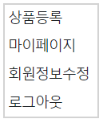
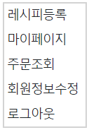
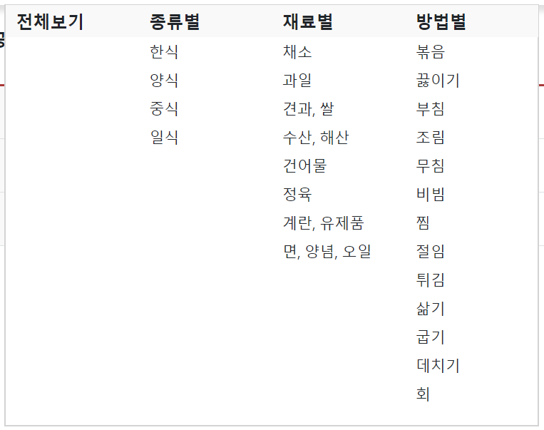
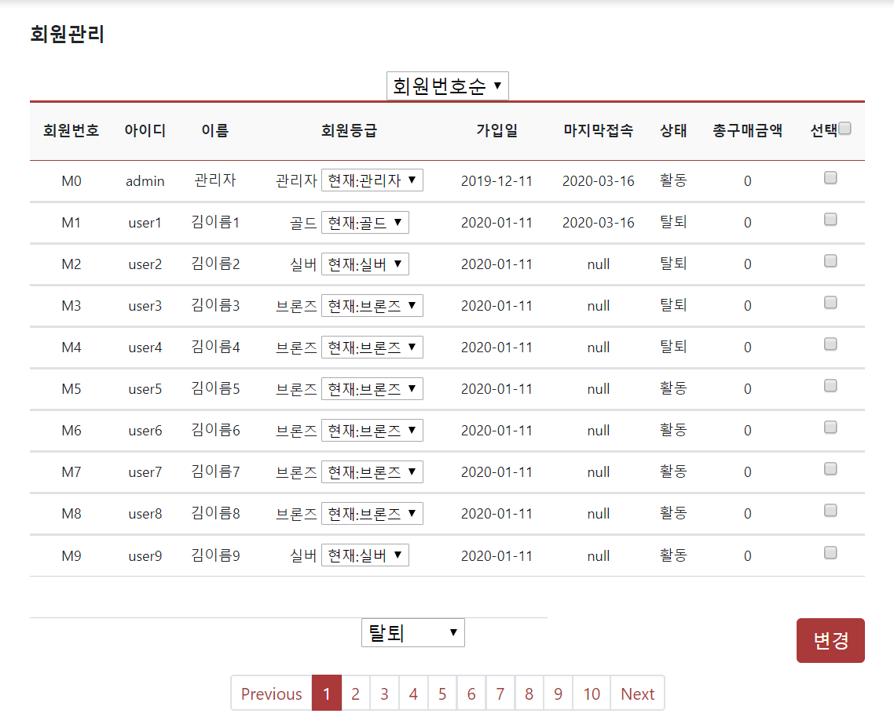
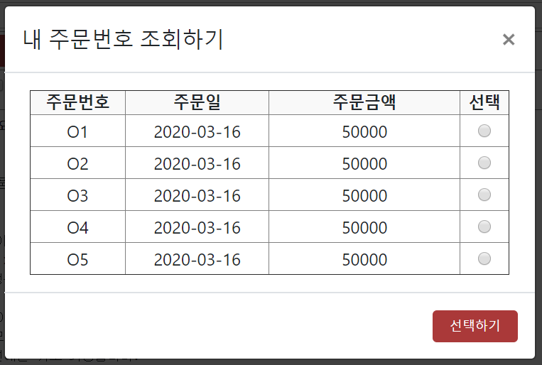

# ChefJ
* 셰프제이는 레시피 공유 및 식자재 구매 원스톱 플랫폼 프로그램입니다. 1인 가구가 증가하며 바쁘더라도 모두 함께 건강한 식단을 섭취하자는 취지를 살려 프로그램으로 만들었습니다. 식자재 장바구니에서 구매까지, 레시피 등록, 조회, 댓글기능, 일반게시판 조회 및 글쓰기, 삭제, 관리자페이지, 고객센터 기능  제공됩니다.
* 제작기간 : 1.5개월
* 제작인원 : 4명

|  
Header1
 |  
Header2
 |  
Header3
 |
|:--------|:--------:|--------:|
|**cell 1x1** | 
cell 1x2 
 |*cell 1x3* |
|**cell 2x1** | 
cell 2x2 
 |*cell 2x3* |
|**cell 3x1** | 
cell 3x2 
 |*cell 3x3* |

## Supported Modules
|:--------|:--------:|--------:|
|**OS** | window10 |
|**개발환경** | Java 1.8, eclipse 2018-09, oracle 11g R2, JSP/Servlet, HTML5, CSS, JavaScript, Ajax |
|**DB** | Oracle 11g, sql Developer |
|**WAS** | Apache Tomcat 8 |
|**DB-design Tool** | Erdcloud |
|**UI-design Tool** | kakaoOven |
|**Library** | Maven, Bootstrap4, jQuery 3.4.1 |
|**version control system** | GitHub |
|**API** | quillAPI(텍스트 에디터), 아인포트(결제 API), 도로명주소API |

## 주요이슈
* 관리센터 : 답변을 여러개 달 수 있도록 구현하였습니다.

## 구현내용
* 메인페이지
  - 메뉴바
    + 서브메뉴, 미니메뉴, 로그아웃
  - 추천레시피, 추천상품 리스트 조회
  
* 로그인/회원가입
  - 유효성검사, 이메일인증, 도로명주소, 아이디 중복검사
  
* 고객센터/관리센터
  - 회원관리
    + 회원정보 조회, 등급변경(ajax), 계정 제재 및 복구
   
  - 1대1문의게시판
    + 페이징처리
    + 주문번호 선택 후 문의글 작성
    + 관리자는 답변 여러개 작성 가능
   
  - 공지사항
    + 페이징처리
    + 글 리스트 조회

## Overview
* **main** - 셰프제이 메인입니다. 추천레시피가 슬라이드형식으로 나오고, 추천 식재료가 카드형식으로 제공됩니다. 로그인 시 회원이름에 마우스오버 시 레시피를 등록하거나 로그아웃, 고객센터로 갈 수 있는 미니메뉴가 나오고, 메뉴 이름에 마우스오버 시 식자재구매 혹은 레시피페이지로 넘어갈 수 있는 메뉴 상세가 나옵니다. 관리자 로그인 시 관리센터 미니메뉴가 나옵니다.
  
  
  
  
  
* **고객센터/관리센터** - 관리자 계정으로 로그인 시 관리센터, 일반회원으로 로그인 시 고객센터로 뷰가 변경되어 보입니다. 페이징 처리가 모두 되어있습니다. 1대1문의게시판은 글 작성 시 주문내역을 조회하여 주문번호 선택 후 글을 작성할 수 있기때문에 상세한 문의가 가능합니다.
 - 회원관리
 
 - 문의게시판 주문조회 - 회원이 문의할 때 자신의 주문번호를 조회할 수 있습니다.
  

